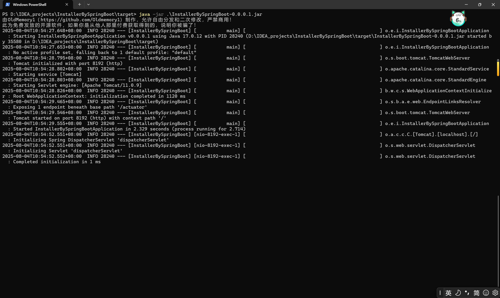

### 项目功能：使用Springboot打包文件，默认服务端口号8192，部署后运行，访问http://localhost:8192 即可看到结果
# Chapter1:使用教程

## 1.1运行环境配置

### 操作系统：建议使用Ubuntu20.04或Windows10-22H2
### 操作系统的Java版本：建议使用17.0.12-64bit以上的JDK版本
### 安装HexEditor Neo等二进制文件查看器软件用于拆分文件 安装包地址:https://hhdsoftware.com/free-hex-editor

## 1.2项目配置

### 使用IDEA打开本项目，本项目适用于将一个大的压缩包使用HexEditor Pro拆分为3个bin文件后，再次封装，同时，携带用户修改后的二进制合并器merger

### 项目的application.properties的server.port字段决定了服务器开启的端口号，如果遇到端口冲突，请把端口号自增1，改为8193，若仍然冲突，请重复自增修改操作

### 项目的resources/files文件夹是存放要下载的文件，如果不想要修改settings.properties，请在resources/files文件夹中存放拆分后的3个bin文件，分别命名为part1.bin part2.bin part3.bin

### 修改settings.properties可以改变待下载文件的文件名的操作，默认待下载的三个文件的文件名为part1.bin part2.bin part3.bin

### 前端界面file-hash-check因为要计算三个较大文件的哈希值，可能打开会较慢，但此界面为可选界面，并不强制要求用户点击，是因为后续的合并器merger需要和所有下载到的bin文件放在同一个目录下，合并器在操作前需要用户手动点击确认文件是否无误

### 在用户下载完成3个bin文件后，网页即可关闭

## 1.3 项目打包

### 在mvn package之前，请使用mvn clean清除文件，打包后的jar包在项目根目录下的target文件夹中，为InstallerBySpringBoot-0.0.0.1.jar

## 1.4 项目运行

### Windows11：在打包后的文件所在的文件夹中，右键选择"在终端中打开"，打开powershell使用java -jar .\InstallerBySpringBoot-0.0.0.1.jar即可运行，随后在浏览器中输入http://localhost:8192 即可访问到网页

